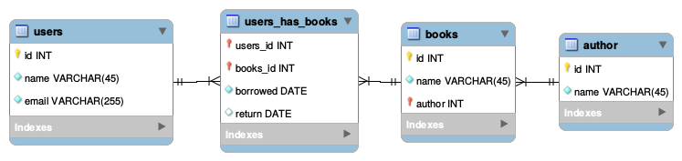

Library technical test
===========================

Ce mini-projet a pour but de tester les compétences techniques en PHP d'un développeur.


## Objectif

L'objectif de ce projet est de réaliser une API pour gérer les livres d'une bibliothèque.
Cette API est composée de 4 actions : 
  - récupérer la fiche d'un livre
  - créer la fiche d'un livre
  - récupérer les fiches de tous les livres
  - récupérer les fiches des livres d'un auteur


Ce projet a été développé avec PHP v7.2 sur Ubuntu 18.04.
Les tests unitaires ont été réalisés avec le framework [PHPUnit](https://phpunit.de/index.html) v7.5.0 


## Spécifications de l'API

Cette API va permettre d'interroger les informations stockées dans la base de données, dont le schéma est le suivant :




### Récupération de la fiche d'un livre 

```
GET /books/:id
```

Cette action doit renvoyer la fiche du livre demandé.

#### Input

_:id_ est l'identifiant du livre

#### Output 

La fiche du livre, au format JSON.

Exemple :

```
{
"data":{
    "id": 6,
    "type": "book",
    "title": "1984",
    "author": {
        "id": 3,
        "name": "George Orwell"
    }
  }
}
```
 
### Création de la fiche d'un livre

```
POST /books
```

Cette action doit permettre de créer la fiche d'un livre.

#### Input

Liste des paramètres (tous sont obligatoires)
 - __title__, titre du livre
 - __author__, id de l'auteur

#### Output 

La fiche du livre créée (Cf. la sortie de l'api `GET /books/:id`)


###  Récupération de la fiche de tous les livres

```
GET /books
```

Cette action doit renvoyer les fiches de tous les livres de la bibliothèque.

 
#### Input
 
 L'action accepte le paramètre _order_ qui peut prendre les valeurs _author_ ou _title_ et triera les livres par auteur ou par titre.

#### Output 
 
 Une liste au format JSON
 
Exemple :

```
{
"data": [
  {
    "id": 1,
    "type": "book",
    "title": "Good omens",
    "author": {
        "id": 1,
        "name": "Terry Pratchett"
    }
  },
  {
    "id": 3,
    "type": "book",
    "title": "Mort",
    "author": {
        "id": 1,
        "name": "George Orwell"
    }
  },
  {
    "id": 6,
    "type": "book",
    "title": "1984",
    "author": {
        "id": 1,
        "name": "George Orwell"
    }
  }
]
}
```
 
 ### Récupération des fiches des livres d'un auteur

 ```
 GET /authors/:name/books
 ```
 
 Cette action doit renvoyer la liste des fiches des livres disponibles pour un auteur donné.
 
 #### Input
 
 _:name_ est le nom de l'auteur en minuscule et des "_" remplacent les espaces
 
 L'action accepte le paramètre _order_ qui peut prendre les valeurs _id_ ou _title_ et triera les livres selon leurs identifiants ou leurs titres.

 #### Output 
 
 Une liste au format JSON
 
 Exemple : 
 
 ```
{
    "data": [
      {
        "id": 1,
        "type": "book",
        "title": "Good omens",
      },
      {
        "id": 3,
        "type": "book",
        "title": "Mort"
      }
    ]
}
```


## Installation

## Prérequis

Ce projet s'appuie sur les éléments suivants qui doivent être déjà installés :

  - serveur web [Apache](https://httpd.apache.org/) version 2.4 (`apache2 -v`)
  - base de données [MySQL](https://www.mysql.com/) version 14.14 (`mysql -V`)
  - langage de programmation [PHP](http://www.php.net/) version 7.2.10 (`php -v`)

Le framework PHPUnit nécessaire aux tests unitaires de ce projet nécessite que les modules PHP `xml` et `mbstring` soient installés.

La présence de ces modules est vérifiable si la commande suivante affiche bien deux résultats (un pour chaque module) :

```
php -m | egrep "^(mbstring|xml)$"
```

Si tel n'était pas le cas, il suffit d'installer ces modules : 

```
sudo apt-get install php7.2-xml php-mbstring
```

### Configuration d'un virtual host pour Apache

Il faut d'abord créer le répertoire d'accueil du site web `library` :

```
sudo mkdir -p /var/www/library/public
```

Pour éviter tout problème de droits, il faut changer le propriétaire de ce répertoire et de tout ce qu'il contient en
l'utilisateur Apache (www-data) :

```
sudo chown -R www-data: /var/www/library
```

Modifier le fichier `/etc/hosts` pour y ajouter le nom de domaine `library` :

```
sudo vi /etc/hosts
```

avec la ligne suivante : 

```
127.0.0.1       library
```

Ajouter la configuration du nouveau site dans le répertoire Apache : 

```
sudo vi /etc/apache2/sites-available/library.conf
```

avec le contenu suivant : 


```
<VirtualHost *:80>
    ServerName library
    DocumentRoot /var/www/library/public

    <Directory /var/www/library/public>
        Options -Indexes +FollowSymLinks
        AllowOverride All
    </Directory>

    ErrorLog ${APACHE_LOG_DIR}/library.test-error.log
    CustomLog ${APACHE_LOG_DIR}/library.test-access.log combined
</VirtualHost>
```

Activer au niveau d'Apache le nouveau site : 

```
sudo a2ensite library
```

Puis vérifier que la configuration soit correcte : 

```
sudo apachectl configtest
```

Et si tout est "ok", alors redémarrer le serveur Apache : 

```
sudo systemctl restart apache2
```


## Création de la base de données de test

Pour ce projet, un script (Cf. fichier database_script.sql) composé de commandes SQL a été fourni.

Pour exécuter ce script et remplir la base `library` (demo_user étant l'utilisateur de ladite base) : 

```
mysql -p -u demo_user -s <  database_script.sql
```


## Installation des dépendances PHP


Pour installer le projet, il faut d'abord récupérer le gestionnaire de dépendances [Composer](https://getcomposer.org/) :

```
curl -sS https://getcomposer.org/installer | php
```

Ensuite, il suffit d'installer les dépendances du projet :

```
php composer.phar install
```

## Configuration du projet

Les éléments permettant l'accès à la base de données (nom de l'utilisateur, mot de passe, nom du server, etc.) sont
à configurer dans le fichier `config\database.php`.  
Un fichier de configuration exemple `config\database.dist.php` est présent comme modèle.  

## Tests

### Tests Unitaires


Les tests unitaires sont exécutables avec la commande suivante :

```
bin/phpunit
```


### Tests Fonctionnels

@TODO : à reprendre

Exemples de requêtes fonctionnelles : 

```
curl -v -X GET http://library/books/1
curl -v -X GET http://library/books/6
curl -v -X POST -d '{"author":1,"title":"I, Robot"}' http://library/books
curl -v -X GET http://library/author/Isaac_Asimov/books
curl -v -X GET http://library/books
```

Exemples de requêtes retournant des erreurs :

```
curl -v -X POST http://library/books
curl -v -X POST -d '{"author":"Baudelaire"}' http://library/books
curl -v -X POST -d '{"title":"Les Fleurs du mal"}' http://library/books
```

